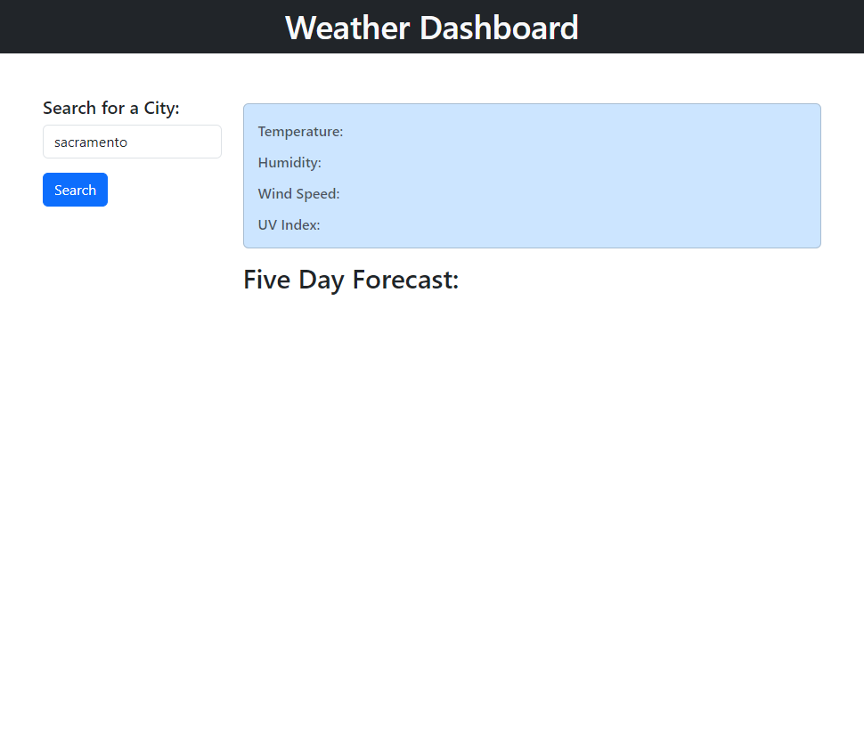

# Weather-Dashboard
### A Weather Dashboard That Runs In The Browser Featuring Dynamic HTML and CSS, That Will Display A 5 Day Forecast For A Given Location
Demonstrating my understanding of server-side APIs, I was tasked with building a weather dashboard application with search functionality to find current weather conditions and a 5-day forecast for cities. The app uses the OpenWeatherMap API to retrieve weather data for cities. Local storage is also leveraged to store persistent data like the last searched city. The following key aspects were implemented:
- Use of HTML, CSS, JavaScript and jQuery to build out the site structure and interactivity.
- API calls made to OpenWeatherMap using the city name to get current and 5 day forecast weather data.
- Data retrieved from API response parsed and used to dynamically update HTML elements for display (temperature, conditions etc).
- Search button click handler makes API call and displays results. Updates localStorage with last searched city.
- On page load, checks localStorage for last city and loads data if available without needing to search again.

## Table of Contents
1. [Acceptance Criteria](#acceptance-criteria)
2. [Work Comleted](#work-completed)
3. [Work To Be Comleted](#work-to-be-completed)
4. [Deployed Application URL](#deployed-application-url)
5. [Deployed Application Screenshots](#deployed-application-screenshots)
6. [Credits](#credits)

## Acceptance Criteria
GIVEN a weather dashboard with form inputs, WHEN I search for a city, THEN I am presented with current and future conditions for that city and that city is added to the search history;
WHEN I view current weather conditions for that city, THEN I am presented with the city name, the date, an icon representation of weather conditions, the temperature, the humidity, and the the wind speed;
WHEN I view future weather conditions for that city, THEN I am presented with a 5-day forecast that displays the date, an icon representation of weather conditions, the temperature, the wind speed, and the humidity;
WHEN I click on a city in the search history, THEN I am again presented with current and future conditions for that city. 

## Work Completed
- Built dynamic HTML and CSS weather dashboard using Bootstrap
- Integrated OpenWeatherMap API to retrieve current and 5 day forecast weather data
- Used jQuery to make API calls on search button click and update HTML elements
- On page load, check localStorage for last searched city and load data if available
- Save last searched city to localStorage on search

## Work To Be Completed
- Add styling and formatting to improve UI/UX
- Find error and debug code to allow for proper call to api to display on UI after city is input into the search box 

## Deployed Application URL
https://sbehashti.github.io/Weather-Dashboard/

## Deployed Application Screenshots

## Credits

Code by Sier Behashti Email: sbehashti@gmail.com GitHib: https://github.com/sbehashti

### Technologies Used
- HTML
- CSS
- JavaScript
- jQuery
- Bootstrap
- OpenWeather API